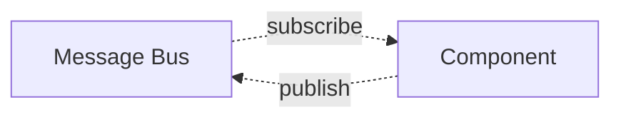
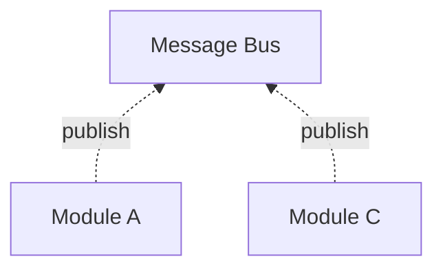
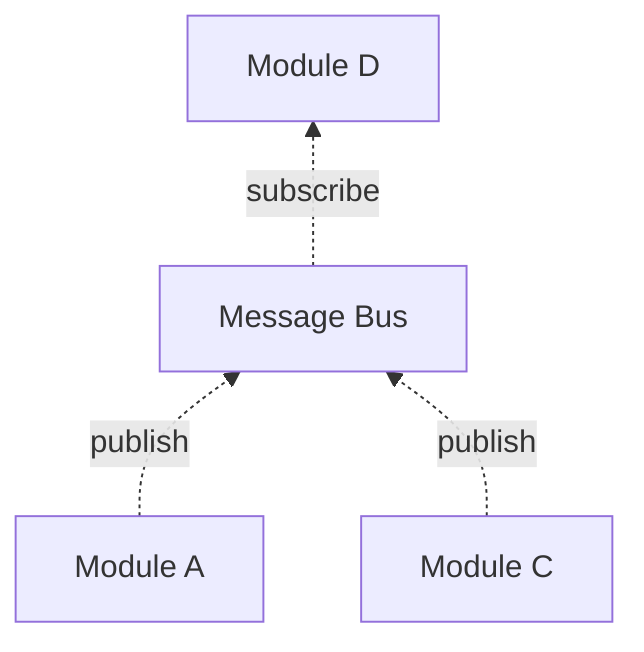
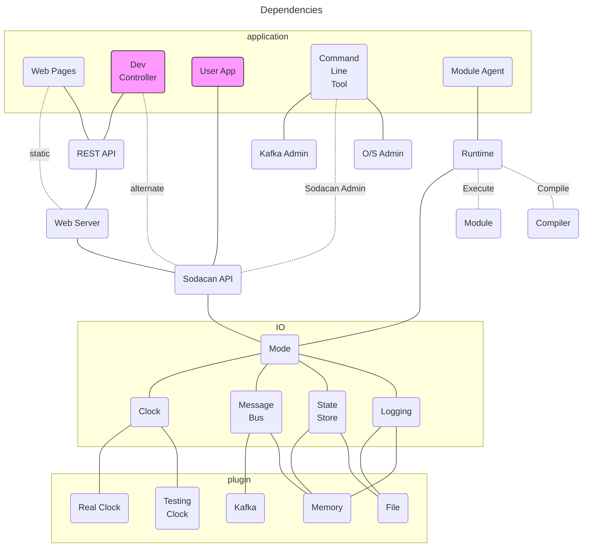
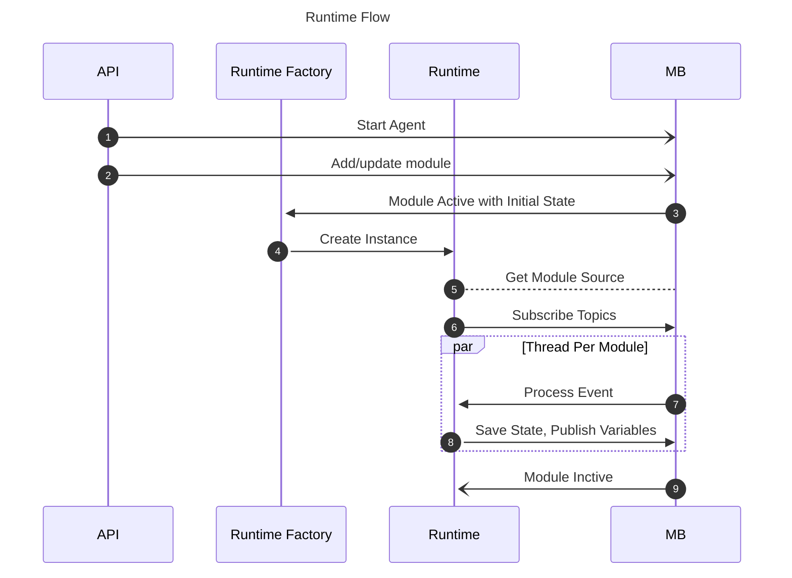
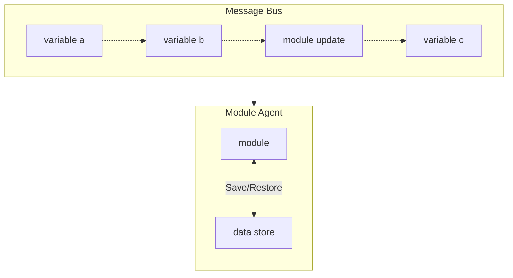

# Architecture
Sodacan is designed as a collection of microservices with an infrastructure to support them. Decision-making microservices in Sodacan are called `Modules`. Microservices that interface with external systems and devices are called "Message Adapters".
In general, Sodacan microservices have the following characteristics:

- Message Oriented
- Independently testable and deployable
- Loosely coupled

Additionally, Sodacan modules are:

- Domain-specific
- Declarative
- Friendly to non-programmers

Message adapters are technical components that
- gather input, create messages, and put them on the message bus, or
- send messages from the bus onto external systems

The technology used by an adapter varies by adapter, but on one side of the adapter is usually the Sodacan message bus. The other side being whatever behavior is needed to interface to message, database, or similar.

### Message Oriented
A message oriented architecture, if taken to its extreme, means that there is a complete decoupling between components. Sodacan attempts to do just that. The cost of a message oriented architecture is that there is an overhead to using messages. An actual message is created by a producer, published to a broker (message bus) and subscribed to by zero or more consumers. In Sodacan terms, modules, which provide the decision making, and adapter modules, which interface to the outside world, are the end-nodes in a message-based system. A nice side-effect of this design is that the overall data-flow is relatively flat: components send messages to or receive messages from the message bus. The only minor exception is that some components may use local IO to access a datastore for persistence.

### Publish Subscribe
Components of this system communicate using publish/subscribe semantics. You should be at least a little familiar with 
<a href="https://en.wikipedia.org/wiki/Publish%E2%80%93subscribe_pattern" target="_blank">publish-subscribe</a> design pattern before reading further. In short, publishing a message means making it available to an subscriber interested in the message. The publisher need not be concerned about the destination of a message. The dataflow though a component is always the same:




### Module Testablility
Modules are 100% standalone with no dependencies on any other modules. Knowing this, the author of a module should not need to be concerned with anything other than what messages that module receives and what messages it produces. And, because it is message oriented, there is no restriction on where messages originate from (or where they go). A module does not need to be "wired up" at any time.

To unit test a module only requires a collection of messages to be fed to the Sodacan runtime and a way to verify that the resulting messages, if any, contain the expected results. The message source will contain the module itself as well as any input messages.

With the use of "deployment mode", a module can be integration tested in a "live" environment with no effect on the real live environment.

### Messages
In Sodacan, `PUBLISH` variables are essentially messages waiting to be sent. And, `SUBSCRIBE` variables are messages waiting to be received. Messages are exchanged through what is called a **topic** which is defined in more detail below. Simply put, a topic groups together messages of a specific format. That format is then the topic name.

All messages contain a `timestamp` which implies a temporal sequence for messages. Messages contain an "offset" attribute which uniquely describes each individual message within a topic.

The producer is also identified in a message. Messages also contain a `key` and a `payload`, both of which are optional.


### Message Bus
Abstractly, a message bus exits to exchange messages. Ignoring security, anyone can produce a message and anyone can consume messages. In Sodacan, the message bus is an implementation detail handled in the background. The modules that make up a system are unaware of the bus itself. Like a post office handles the logistics of getting a newspaper from its source (producer) to its destination(s) (consumer(s)). In a message bus architecture, the producer of a message as no control over who consumes that message. And, in general, the consumer has no control over who, how or when the messages it receives are produced. This is the essence of decoupling in a microservice architecture.

In the following diagram, messages are produced by Modules A and C without any knowledge of where they will be consumed or even *if* they will be consumed.


When Module D is added, it can consume messages from the message bus as it sees fit.



### Message Producer
A `MODULE` that contains one or more `PUBLISH` statements is a message producer. Each `PUBLISH` variable is sent onto the message bus.
### Message Consumer
A `MODULE` that contains one or more `SUBSCRIBE` statements is a message consumer. 
A module is only able to "see" the information it receives via message (or the passage of time). In Sodacan, there is no such thing as peeking into another module to find a value. So, it is important to ensure that information needed by a consumer arrives via message. 

### Topology
The underlying messaging technology will determine the topology of a working Sodacan installation and how application components are deployed.
The following table show the application components and where each resides in different configurations:
#### Stand-alone
A Sodacan stand-alone configuration is useful for simple demonstrations and some development. It uses no communication except for a web server and it would be difficult to connect to real devices. Persistence is periodically stored in a flat file in JSON format. No reliability guarantee of the data. Communication between modules and the message bus all occur in a single address space. Keep in mind that performance in this simple configuration will be very fast. But it won't scale well. Don't try to draw conclusions about performance from this configuration.
#### Single-node
A Single-node configuration uses Apache Kafka in a more-or-less real configuration but has no redundancy and does not scale. All of the components are the same as a distributed configuration though communication between components may still be faster because they are all on the same node. For a smaller installation without the need for high-availability and fault tolerance, the single-node configuration may be sufficient. Almost all unit and integration testing will work fine in this configuration. The part that isn't covered will be specific to Kafka.
#### Distributed
A distributed configuration also uses Apache Kafka but with multiple brokers and topic partitioning. This configuration provides the highest throughput, scalability and best reliability. The transition from single-node to a distributed configuration is possible without having to start-stop the system. However, it does require careful planning and execution.

### System Components



### Runtime Behavior
An API call initiates module processing in one of several threads involved in the processing of messages. Most of the remainder of this section is under the control of the message bus which calls back to a module runtime. Put simply, the message bus will notify the runtime factory that a specific module is active allowing the runtime to fetch and compile the module's source code and setup structures needed for that module. The message bus will then feed messages to that runtime as they arrive.

Each module runtime will be called from a separate thread but messages for any one module will be delivered sequentially.

The following diagram shows the key interactions between the API, the message bus, the runtime and runtime factory.



1. An API call gets things started by establishing an Sodacan Agent. The message bus starts running a separate thread.
2. The application is then free to add, change or delete modules using the API. This can be done at any time before or after the agent is started. The module changes become part of the message flow which will cause the runtime to be updated when the changed module arrives.
3. The message bus (agent) will then make a call to the runtime factory whenever it determines that a message has arrived for that module. 
4. The runtime factory creates an instance of the runtime bound to that one module. The runtime is expected to remain active for that module until deactivated. 
5. When the runtime for a module starts up, it will need to call back to the message bus to get the source code for that module, compile it, and create any structures that it needs.
6. The runtime will also need to tell the message bus what topics it subscribes to. The message bus will subscribe to each of these topics plus the tick source plus module state messages.
7. At this point, the Message Bus will deliver one message at a time to the runtime's processMessage method. The runtime will execute the module using the incoming message.
8. When done, the runtime will save the state of the module's variables by sending them back to the message bus. This makes the variables available to other modules that have subscribed to them.
9. When the message bus determines that the module is no longer active, it calls back to the Runtime which can then release any resources that it may have.

### Message Bus Behavior
While it may appear that the message bus runs all modules in a single address space, that is not usually the case. For the Kafka plugin, here's how it actually works.
In Sodacan, a given module can only be executing in one place at a time and processing a single stream of events. If there is only a single "agent" running, then in fact all active modules will be in memory at the same time.

However, if two or more agent's are running, then each agent gets a share of the modules. If more agents are running than there are modules, then the extra will be running idle. The extra agents can be though of hot backups since Sodacan (Kafka broker) can redirect traffic to the waiting agent at any time. If a new module is added to the system, this also affects what is running where. The message bus (Kafka) is free to "rebalance" the load at any time meaning the runtime and runtime factories must respond to the activation and deactivation callbacks.
 
Due to the nature of Kafka, subscription to multiple topics are not merged and delivered in timestamp order. (Within a topic, order *is* guaranteed). Therefore, Sodacan adds an intermediate "priority queue" so that as events are received, they are added to the queue which is ordered by timestamp and then delivered to the module's runtime. The ordering issue only comes up when processing is stopped and therefore has to "catch up".

#### Topic Allocation
Each module gets its own topic. That topic will contain one message per processing cycle. This topic is what the module uses to store state and it is also what other module subscribe to if that module is interested in the results of this module.

Another topic is used to maintain a list of all modules. 

There is a single topic containing all versions of all module's source code. Only the Kafka offset for a particular version of a module is referenced in the module's state. This keeps the state record small. When the runtime sees a change in the offset for the module source code, it will fetch the new module and compile it. As with all other activity related to a module, this compile happens **between** events.


### Module Origination

The source code for a module begins on the file system. After initial introduction to Sodacan, it can be extracted from the message bus and updated.
 In any case:

- Compile the module, this yields the module and a newly minted collection of variables known to that module.
- The variables for a module have a different lifecycle than the module source code. For example, variables are unaffected by a source code change.
- A topic is created for each new module. If the module already exists, the topic is unchanged.
- This topic may already exist if some other module subscribed to it. But it won't contain any records.
- Conversely, this module will create any topics needed by its `subscribe` variables.
- The module's state topic is updated after each processing cycle for that module.
- Therefore, the last record in the topic contains the most recent state of the module. That is, offset minus one.


### Sticky (named) Agents
Any agent that runs as a named agent is not counted as an available agent. That type of agent simply starts up and begins processing for the modules that have been tied to that named agent.

When an unnamed agent starts up (it can be on any server in the network), it also names itself by creating a local file with the name or reading that file if it already exists. The name is arbitrary but must be unique. Usually a GUID and should be stable over time. It knows of no modules. The agent reads the list of known agents which contains the current status of all agents. This includes which modules that that agent is currently running. But the agent still has not been assigned any work.

Each agent subscribes to the Master-Agent topic, but only one (doesn't matter which) is going to receive records and handle the shuffle. So, if an agent goes down, another will pick up the ball. This control agent (a normal agent with control responsibilities) keeps the list of all modules and the list of agents and status by reading the module and master queues. When an agent starts up and sends its status to the Master-Agent topic, the control agent receives the message and calculates a distribution of modules to agents. Some agents may get fewer modules and others may get more.

The control agent then affects this new distribution using a two-phase process. The first phase is to shut down modules that are destined to move from their current agent. During this phase, the modules that are moving are not processing any messages but their state is available in the module state and inbound message topic. The control agent waits until all agents has responded with their new current status. Now, the modules that have been shuffled are added to the list belonging to the new agent. Now the Master-Agent topic contains the new configuration and each of the agents sees their own configuration with their
new modules that need to be added, if any.

So much for the happy path. What happens for edge cases:

1. An agent goes down unexpectedly: Eventually, the control agent will notice this because no "heartbeat" status messages and will unilaterally shuffle modules among the remaining agents.

2. The Agent with Control Goes down: All agents are listening to the Master-Agent-Status queue. The underlying infrastructure will cause the subscription in another agent to start up, it becomes control.

3. An non-control agent goes down during the shuffle: The two-phase shuffle proceeds as usual, however, the down agent fails to provide status so it
causes control to reshuffle again using the reduced list of agents.

4. Control agent goes down: Control is automatically assign to one of the other agents. Otherwise, the same as above.

 
Upon receipt of this *new* distribution of modules to agents, an agent causes its current modules that are not on the list to shut down. It again publishes its status at the conclusion of the shutdown process confirming to control that the requested modules have been shut down.


#### Sodacan API
The Sodacan API provides a way to perform administrative, operational, and application functions. Many of its functions are passed through messages to other components including the Sodacan web server, the underlying Kafka system, and mostly to Sodacan agents.
The API in Sodacan is separate from the RESTful API in the web browser. Both provide similar capabilities but the Sodacan API talks directly to the message bus whereas the RESTful API is, of course, HTML-based which in turn uses the Sodacan API. The RESTful API is useful when the Sodacan message bus is behind a firewall or where it is more practical to use an HTTP-based solution.

#### Command Line Tool

The Sodacan command line tool provides a number of administrative functions including stating and stopping the server(s), creating topics, compiling and deploying modules, creating and managing modes, etc. It uses the Sodacan API.

#### Web Server
The web server provides the same capabilities as the command line tool but in a graphical format. It also includes a dashboard for monitoring a running system. It uses the Sodacan API. The web server is also what exposes the Sodacan RESTful API. Sodacan uses static web pages, which it serves, which in turn call the same APIs which remote applications can use independent of web page, subject to authentication and authorization.

#### Message Bus
The Message Bus is a wrapper around Apache Kafka. Kafka is accessed only through Kafka's client APIs. An existing Kafka (and Zookeeper) installation can be used if necessary. A docker-based Kafka installation is also usable but be certain to externalize the message storage. The message bus wrapper (in Java) is needed to support the stand alone configuration and for unit testing Sodacan core code. It also allows plugin of an alternate message bus although no such plugins are available in Sodacan, yet.

The message bus in Sodacan is responsible for reliably storing messages for however long is needed. This is the primary means of storage in Sodacan. Messages are the official "source of truth" in Sodacan. The other data stores such as module persistence can be recovered by replaying messages. When the Message Bus is Kafka, each Kafka broker stores these messages close to where the broker is running. If Kafka is running with replica > 1, then there will be multiple copies of messages on different brokers.

If the stand alone configuration is used, then messages are not stored reliably.

#### Module Agent
Module agent(s) are the workhorse of Sodacan. These agents host one or more modules and provide the timer, clock, persistence, and interface to the Message Bus.

#### Logging Agent

 | Component         | stand-alone | Single Node | Distributed |
 | :----             |  :--------: | :---------: | :---------: |
 | Command Line Tool | The entire system runs inside the tool. | 
 | WebServer	     | N/A         |   
 | MessageBus	     | N/A 
 | LoggingAgent	     | N/A 
 | ModuleAgent	     | N/A 
 | ModulePersistence | N/A 
 | LoggingAgent	     | N/A 
 
The smallest configuration will have a single agent that runs all modules in all modes in one memory space.

### Module Topic Structure
Each module has it's own topic. More specifically, topics are named as follows:

 | Component        | Description |
 | ----------- | ----------- |
 | "m-"      | Prefix to identify all module state topics       |
 | module | The module name |
 | "-"   | Separate module name from mode name |
 | mode      | Deployment Mode. Not to be confused with any variables that happen to be named mode.       |

### Message Format
Messages are organized by topic as described above. Within a topic, individual messages contain these fields:

 | Field  |Location|  Description |
 | ----------- | ----- | ----------- |
 | Offset      | internal | A permanent incrementing non-repeating integer within the topic |
 | Timestamp  | internal | When the message was published |
 | Producer | internal | The name of the producer (eg module) that gave rise to this message |
 | mode      | key | Deployment Mode. Not to be confused with any variables that happen to be named mode.       |
 | domain | key | The full domain name of the local Sodacan broker |
 | topic | internal | The *original* topic name *may* be the same as producer, and is usually the same as the name of the topic containing this message |
 | instance | key | The module's instance, if any |
 | variable | key | The variable (or event name) | 
 | value | value | The value of the variable, if any|

### Message Delivery
When a message is published, it is immediately available to any subscribing modules, baring hardware or infrastructure difficulties. If a consumer (module) is unavailable, the message will be delivered when the component is restored.

Latency between a message being published and being consumed should be in the neighborhood of 1-20 milliseconds, depending on the underlying hardware. Any application that depends on faster delivery should seek another solution.

### Module Persistence
******* Fix this
Since events arrive at a module one-by-one, it is important to maintain state within a module. For example, a lamp module might have a "mode" setting that determines how other messages are handled. The mode-setting message will have arrived sometime before subsequent messages are processed that need the value of the mode setting. In the following, the `mode` variable will have been set via message some time in the past. When midnight arrives, that variable will be needed. Between those two times, the module may be off-line (crashed, power failure, explicitly taken off-line, etc). So, when the module needs to be restored, the variables must also be restored. 

```
	MODULE lamp1
		SUBSCRIBE mode	{off, auto, on}	
		PUBLISH state {on,off}
		AT midnight       // Turn off this light
		  AND mode.auto  // at midnight
		  THEN state=off  // if mode is auto
		
```
Persistence is handled automatically by the infrastructure. Underneath is a directory structure with a text file that is used to save and restore module state for each module and instance.  Call a module snapshot.

```
	<agent working directory>
		<mode name>
			<domain name>
				<module name>
					<instanceName>.scc.json
```
 
The content of the .scc.json file is a json representation of the module's variables, including the values, AST and source code of the module.

Now, this .scc.json file is completely redundant. Why? Because the variables in the module
instance were populated by messages... and only messages. And, the messages that were consumed by a module that resulted in 
the variable's current values are still around (in the message bus)! 
That means one way to restore the current state of a module is to simply replay the message stream
into that module (the output of the module can be ignored during this recovery).

So, the snapshot file is just there for performance reasons. It would take much longer to replay messages, 
sequentially, in order to recover a module's state than to simply load state from an indexed database optimized for random access.

The module agent creates a snapshot for the module periodically and stores it in the data store.

The final aspect of module persistence is the module "code" itself. When a new version of a module is compiled and then deployed, it is published as a message which the agent hosting the module intercepts and replaces the existing module code. This has a very nice effect: the point at which a module was changed in the stream of messages it processes is preserved in the message stream. In other words, a full audit trail is created. It also means that there is no need to manually deploy new modules as they are created or modified. The flow of messages into a module might look like this:



So, the module code itself is also stored in this data store under the special variable name `%%code%%`

The Sodacan agent is free to completely remove rarely used modules from memory and restore the module's code and variables as messages arrive.
## Infrastructure
### Module deployment
Each module and adapter is deployed as an independent program on a host computer. 

The Sodacan command line interface provides all the information needed to start and run a module or an adapter module. In the case of an adapter module, it is often desired that that module be deployed to a specific host since it may have code that interacts with one or more devices connected to that host.

In other respects, modules are deployed randomly to available Sodacan agents.

## Web Application
The Sodacan web application has several top-level windows:

- User Account - maintain the user's account, login page, etc
- Administration - Create users, maintain topics, 
- Operations - Monitor message bus storage and message traffic
- Application Console - Modules, buttons, etc 

See <a href="../webserver/README.md">Web Server</a> for more details.

### Comparisons to Conventional Approaches
Modules can be thought of a Java/C++ class definition but in reverse. The term "static" is used to distinguish class-wide variables whereas Sodacan makes variables without any indication otherwise, a static. Conversely, when referring to an instance variable, Sodacan requires what may look like an array reference to instance variables.

Module Persistence in Sodacan is not unlike systems such as Apache Flink which, like Sodacan, stores persistent data with the end-point rather than having to connect to a database. This approach, along with messaging, virtually eliminates the need to deal with database concurrency, locking and similar problems.

The module language is line oriented, similar to Python but without its indent sensitivity. Unlike many languages in use today, Sodacan module language is case insensitive.

Aliases are used in modules and they look like a SQL alias:

```
	SELECT primaryPhoneNumber AS ppn FROM ...
	
```
In a Sodacan Module

```
	MODULE lamp1
		PUBLISH mydomain.verylongname AS shortName
		...
```

They also work the same as in SQL and follow the expression or variable as in SQL.

The module language is closer to a domain-specific language than a true programming language for several reasons:

- It has very little technical chatter. Only a few very broad data types. No such thing as int, int_32, BigDecimal, etc. Just a number (Sodacan uses the term DECIMAL).
- The hierarchy is shallow. There are modules and variables within modules and that's about it. Traditional `IF` statements and code blocks (begin-end-style) are not used to keep the module shallow. This is similar to the way some rule languages control the depth of statements.
- Invocation is different from traditional programming languages. No such thing as a function or method call. When a message arrives in a module, it is immediately stored in a variable. This activates the module for one cycle. The module then waits for the next message to arrive. This means that open/close/loops etc are unnecessary.

The `THEN` statement might seem novel. If there is more than one thing to do as a consequence of a conditional expression, then the `THEN` is repeated.

```
		...
		THEN do the first thing
		THEN do the second thing
```

This extra bit of typing (THEN) eliminates the need for expression separators such as a semi-colon.

