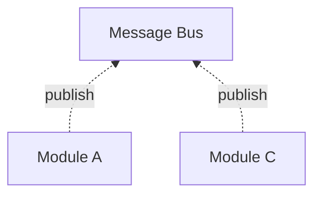
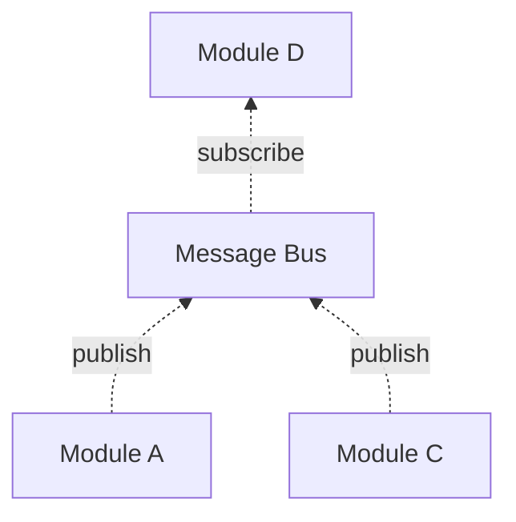
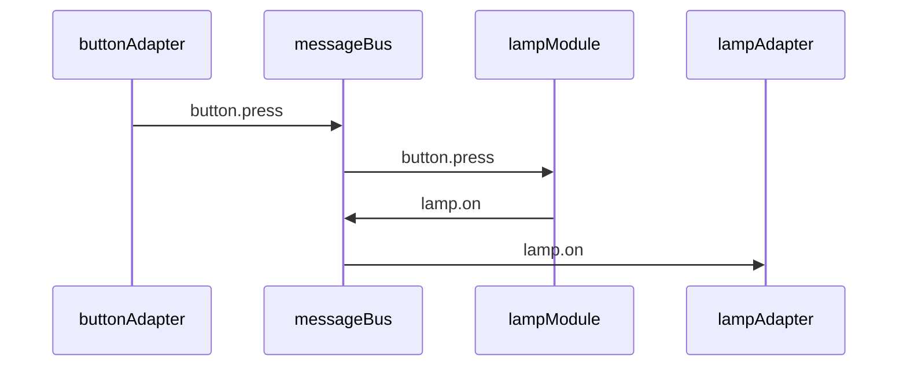

# Architecture
## Microservice Architecture
SodaCan is designed as a collection of microservices with an infrastructure to support them. Decision-making microservices in Sodacan are called `Modules`. Microservices that interface with external systems and devices are called "Message Adapters".
In general, SodaCan microservices have the following characteristics:

- Message Oriented
- Independently testable and deployable
- Loosely coupled

Additionally, SodaCan modules are:

- Domain-specific
- Declarative
- Friendly to non-programmers

Message adapters are technical components that
- gather input, create messages, and put them on the message bus, or
- send messages from the bus onto external systems

The technology used by an adapter varies by adapter, but on one side of the adapter is usually the SodaCan message bus.

## Publish Subscribe
Components of this system communicate using publish/subscribe semantics. You should be at least a little familiar with 
<a href="https://en.wikipedia.org/wiki/Publish%E2%80%93subscribe_pattern" target="_blank">publish-subscribe</a> design pattern before reading further.

### Messages
In SodaCan, `PUBLIC` variables are essentially messages waiting to be sent. And, `SUBSCRIBE` variables are messages waiting to be received. Messages are exchanged through what is called a **topic** which is defined in more detail below. Simply put, a topic groups together messages of a specific format. That format is then the topic name.

All messages contain a `timestamp` which implies a temporal sequence for messages. The producer is also identified in a message. Messages also contain a `key` and a `payload`, both of which are optional.


### Message Bus
Abstractly, a message bus exits to exchange messages. Ignoring security, anyone can produce a message and anyone can consume messages. In SodaCan, the message bus is an implementation detail handled in the background. The modules that make up a system are unaware of the bus itself. Like a post office handles the logistics of getting a newspaper from its source (producer) to its destination(s) (consumer(s)). In a message bus architecture, the producer of a message as no control over who consumes that message. And, in general, the consumer has no control over who, how or when the messages it receives is produced. This is the essence of decoupling in a microservice architecture.

In the following diagram, messages are produced by Modules A and C without an knowledge of where they will be consumed or even if they will be consumed.


When Module D is added, it can consume messages from the message bus as it sees fit.



### Message Producer
A `MODULE` that contains one or more `PUBLIC` statements is a message producer. Each `PUBLIC` variable is sent onto the message bus.
### Message Consumer
A `MODULE` that contains one or more `SUBSCRIBE` statements is a message consumer. 
A module is only able to "see" the information it receives via message (or the passage of time). In SodaCan, there is no such thing as peeking into another module to find a value. So, it is important to ensure that information needed by a consumer arrives via message. 
### Topic Structure
Each module has it's own topic. More specifically, topics are named as follows:

 | Component        | Description |
 | ----------- | ----------- |
 | mode      | Deployment Mode. Not to be confused with any variables that happen to be named mode.       |
 | domain | The full domain name of the local SodaCan broker |
 | module | The module name |

### Message Format
Messages are organized by topic as described above. Within a topic, individual message contain several component:

 | Component  |Location|  Description |
 | ----------- | ----- | ----------- |
 | Offset      | internal | A permanent incrementing non-repeating count within the topic |
 | Timestamp  | internal | When the message was published |
 | mode      | key | Deployment Mode. Not to be confused with any variables that happen to be named mode.       |
 | domain | key | The full domain name of the local SodaCan broker |
 | instance | key | The module's instance, if any |
 | variable | key | The variable (or event name) | 
 | value | value | The value of the variable, if any|
 
### Module Persistence
Since messages arrive at a module one by-one, it is important to maintain state in a module. For example, a lamp module might have a "mode" setting that determines how other messages are handled. The mode-setting message will have arrived sometime before subsequent messages are processed that need the value of the mode setting. In the following, the `mode` variable will have been set via message some time in the past. When midnight arrives, that variable will be needed. Between those two times, the module may be off-line (crashed, power failure, explicitly taken off-line, etc). So, when the module needs to be restored, the variables must also be restored. 

```
	MODULE lamp1
		SUBSCRIBE mode	{off, auto, on}	
		PUBLIC state {on,off}
		AT midnight       // Turn off this light
		  WHEN mode.auto  // at midnight
		  THEN state=off  // if mode is auto
		
```
Persistence is handled automatically by the infrastructure. Underneath, a key-value database is used to save and restore module state. The key of each row includes the following:

 | Key Component        | Description |
 | ----------- | ----------- |
 | mode      | Deployment Mode. Not to be confused with any variables that happen to be named mode.       |
 | domain | The full domain name of the local SodaCan broker |
 | module | The module name |
 | instance | The instance key (for example, location of a light switch) |
 | variable | The name of the variable
 
 The value associated with this key is, of course, the value in the variable.
 
 Now, this key-value database in completely redundant. Why? Because the variables in the module
 instance were populated by messages. And only messages. And, the messages that were consumed by a module that resulted in 
 the variables current values are still around! 
 That means that, one way to restore the current state of a variable is to simply replay the message stream
 into that module (the output of the module can be tossed during this recovery).

So, the key-value store is really just there for performance. It would take much longer to replay messages, 
sequentially, in order to recover module state than to simply load state from an indexed database optimized for random access.

The final aspect of module persistence is the module "code" itself. When a new version of a module is compiled and then deployed, it is published as a message which the agent hosting the module intercepts and replaces the existing module code. This has a very nice effect: the point at which a module was changed in the stream of messages it processes is preserved in the message stream. In other words, a full audit trail is created. It also means that there is no need to manually deploy new modules as they are created or modified. 

So, the module code itself is also stored in this database under the special variable name `%%code%%`.

The SodaCan agent is free to completely remove rarely used Modules from memory and restore them as messages arrive.

### Topic
In SodaCan, all topics, and therefore, all messages must be formally defined.
A topic defines a schema, or format, of messages for a specific purpose. 
Once defined, a topic usually lasts forever, or until manually deleted.
A `MODULE` that contains `TOPIC` statements defines independent topics, that is, a topic that does not include the module name in its name.

### Module behavior
A module waits quietly for either the passage of time or a message to arrive. If two or more messages arrive at the same time, one is chosen to go first. At that point, the list of `AT` (in the case of the passage of time) or `ON` (the arrival of a message) statements is considered, one at a time, in the order which they are declared, until one *matches*. The `THEN` statement of the corresponding `ON` or `AT` is executed. Each message or passage of time is processed by a module is called a `cycle`.

The passage of time may not trigger any `ON` statements. That's normal. However, 
for messages, if no matching `ON` statement is found, then an error is thrown. Why? When a `module` subscribes to a particular topic, it declares its intent to deal with that message. If that doesn't happen, there's a problem: Either the `SUBSCRIBE` is wrong or the `ON`s are wrong or missing. 

### Module Time
The passage of time is important to automation problem. Within a module, the `AT` statement demonstrates the need for time based events, however, the infrastructure has a huge responsibility to interpret the requirements and respond accordingly. And do it efficiently. One particularly complex aspect is being able to reproduce the passage of time in the future. In other words, we need to be able to look back in time and see that an `AT` event was actually triggered. 
Conceptually, it looks like this (but don't try this at home). The lines with * are imaginary.

```
	MODULE lamp
		*PUBLIC AtNoonOnFridays
		...
		AT noon ON fridays // Raise an event at noon on Fridays
			*THEN activate(AtNoonOnFridays)
			THEN ... what happens at noon on Fridays
		*ON AtNoonOnFridays
			*THEN ... what happens at noon on Fridays
```
 

Here's how this works in Sodacan: Unlike `ON` statements, which respond to explicit messages, `AT`statements are simply watching a clock looking for a match. To make these time-based events auditable and reproducible, the `AT` statements do watch the clock, but when one matches, it doesn't take action directly. Rather, a special message is sent to the module (itself) which then reacts as if it were an `ON` statement (This special message is invisible to the module author).

1. "AT noon ON Fridays" matches the current time (it is noon and it is a Friday. 
2. The agent running the module constructs and sends a special message with the id of the `AT` statement. 
3. The special message is then processed as usual a moment later. Should the module currently be busy with a different message, then the special message will be processes after that one is done. At this point, `ON` message flow and `AT` message flow have been synchronized.
4. When the special message is processed but the module, the `THEN` statement of the corresponding `AT` is executed. If there is a `WHEN` statement as part of the `AT` statement, it is also evaluated and may result in the special message being ignored.
5. At this point, the module can go back to listening for new messages.

Then, when needed, there is a complete audit trail in the message stream including hard `ON` events and timed `AT` events in the order in which they were processed.

### Module Instance Time

A slight complication in modules involves `AT` statements. If a module is declared as having an instance key and one ore more `AT` statements, such as:

```
	MODULE lamp[location]
		...
		AT noon ON fridays
			THEN ...
``` 

### Message-Variable Duality
In SodaCan, a variable defined in a module becomes the source or destination for messages. When a message arrives, it is immediately stored in the named variable thus making it available to the module. In the following example, lamp1 is interested in the state of switch 1.

```
MODULE lamp1
	SUBSCRIBE switch1.state {on,off}
	...
	ON switch1.state.on
		THEN ...
```
Behind the scenes, SodaCan consumes a message and makes a note if its value has changed. If it did, it signals an event which the `ON` statements in the module will react to. 

The publishing side is similar. A `PUBLIC` variable is a message-in-waiting. Once a processing cycle is completed, and `PUBLIC` variables that have been modified will be published.

```
MODULE switch1
	PUBLIC state {on,off}
	...
	ON ...
		THEN state.on		// Set the state to on
```

In the background, SodaCan monitors this variable and, if any changes are made to it by the module due to a an incoming message or due to the passage of time, a message will be published containing that variable. In this example, `state` is the variable so the message will be published as `switch1.state` with a value of `on`.

### Module Instantiation
In simple configurations, there may only be a single instance of each type of module. One living room lamp, one living room light switch, etc. In this case, messages will have an empty `key` attribute.  Other modules can be configured to handle a class of devices. For example, an organization might have a single lighting configuration which is used in different locations. Each office, for example, could behave the same but independent of other offices. In this case, the `'key' attribute of a message will contain the office (or location) name. Not much changes when a module is representing a class of devices rather than a single device. The module name would normally change. Instead of

```
	MODULE JoesOfficeLight
```

a more appropriate module name in this case might be

```
	MODULE OficeLight[location]
```
which says there is a single office light *class* of module but that a separate *instance* of the module is created for each location.
Of course in this case we also need to make sure our variables are separated by location. 

```
	MODULE OficeLight[location]
		PUBLIC state[location] {on,off}
		
```
which tells SodaCan that the `state` variable is separate for each location.

While the state variable (and consequently messages) are per-location, we might need other variables that apply to the entire class. Consider a company that has a policy of putting all lights into auto mode at a certain time of day requiring motion detecting for the light to remain on. That time is set company-wide. In this case we would like to send a single message to the "OfficeLight" module with the time all offices should go into auto mode. 

```
	MODULE OficeLight[location]
		SUBSCRIBE autoModeOnTime 00:00
		PUBLIC state[location] {on,off}
		
```
Notice that the `autoModeOnTime` variable has no key associated with it. A subsequent `AT statement` will refer to `autoModeOnTime`, without a key qualifier.

```
	MODULE OficeLight[location]
		SUBSCRIBE autoModeOnTime 00:00
		PUBLIC mode[location] {auto,manual}
		PUBLIC state[location] {on,off}
		AT autoModeOnTime
			THEN mode[location].auto
		...
		
```
### Adapters
A SodaCan adapter is an end node in a SodaCan implementation. There are two primary types of adapter: message consumer and message producer. However, adapters can also be a consumer and producer at the same time. 
By design, adapters have no persistence. They are stateless. 
The following is a very simple implementation of a lamp and a button and a module that controls the behavior of the lamp (on or off). A real-world example would likely have additional capabilities but we keep it simple here:


Flow of control:
1. `buttonAdapter` running on a microcontroller such as a Raspberry PI, monitors a *digital in* pin and when it goes positive (ignoring debounce logic), a message is published to the SodaCan `messageBus`.
2. The message is delivered to the `lampModule` which has subscribed to this type of message.
3. The `lampModule` determines if the button press is and off or on transition (it keeps track of the state of the lamp).
When the state of the lamp in the `lampModule` changes, another message containing the new state is published to the `messageBus`.
4. The `lampAdapter`, running on a microcontroller subscribes to lamp's state message and upon receipt of this message sets a digital output pin high or low depending on the content of the message.

### Message Persistence
When a message is produced, it takes on a life of its own; Neither belonging to the producer nor to any of its potential consumers. At that point, the message is owned and stored (persisted) by the message bus. 
There is no sure-fire way for SodaCan to know when a message has been completely consumed. For example, a module that *might* consume a particular type of message 
may not exist yet. If resources were infinite, there is no reason SodaCan would need to recover space used by any messages.
The messages within a topic can come and go. Indeed, most topics define the lifetime of messages contained within that topic.

Consider, for example, that we want to add a new module to an existing configuration that reports on the average number of uses of a certain button per month. In a traditional system, the data could be a challenge to create. Historical data may not even exist. But in SodaCan, the data already exists in the topic that was used to get the button press notification to the lamp that is controlled by that button press. (Just because the message was *consumed* by one module does not mean that the message will be discarded). So, the new reporting module simply subscribes to that same topic and it will get all of the messages from the past in chronological order.

Now, SodaCan has several ways to deal with old messages in a topic. One can set an expiration date for a particular topic: Messages older than a certain number of days, weeks, months, or years will be automatically deleted. Or, when a topic exceeds a certain size, older messages can be deleted. Finally, one can just let the messages accumulate forever. Consider that many messages in a SodaCan application are quite small. Our button activation message will be about 50 bytes long. If we press that button 50 times per day, every day for a year, that would add up to less than one megabyte of data. Therefore, it's probably not worth cleaning up this type of message if there is even a small change of using that data in the future. On the other hand, messages from a security camera are much larger and so the topic should probably be purged either based on size (a very safe option) or the age of messages.

### Other Messages
The messaging system is also used for administrative and operational purposes. Any agent running a module or an adapter routes error messages to a log topic.
SodaCan uses an administrative topic to deploy modules and adapters to the appropriate agent/server. Therefore, in a clustered setup, it is not necessary to manually keep application files on individual servers. By default, Module persistence is also kept in an administrative topic. 
## Infrastructure
### Module deployment
Each module and adapter is deployed as an independent program on a host computer. 
The SodaCan command line interface provides all the information needed to start and run a module or an adapter.
### Deployment Modes
When its time to roll out a new or updated module or adapter, you might want to do a final test on the live system without affecting the live system. To do this, the soda administrative tool can be used to initiate a "copy" of the current (default) mode to a separate mode, probably named something like "test-new-light-control". Subsequent actions can also also supply the mode so that the action affects that mode only, not the current live modules.

The copy operation is quite comprehensive. In particular, new topics with the same name as before with the mode appended.Modules are also renamed with the mode appended to the modules and adapters.
