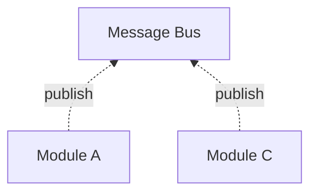
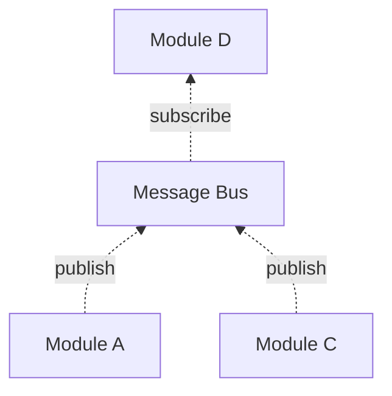
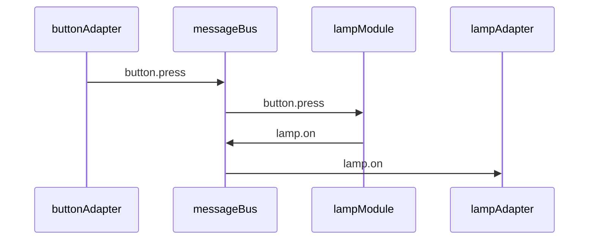
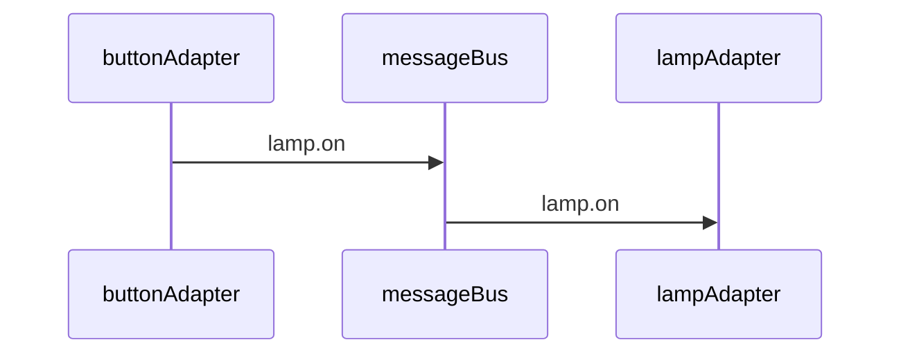

# Architecture
SodaCan is designed as a collection of microservices with an infrastructure to support them. Decision-making microservices in Sodacan are called `Modules`. Microservices that interface with external systems and devices are called "Message Adapters".
In general, SodaCan microservices have the following characteristics:

- Message Oriented
- Independently testable and deployable
- Loosely coupled

Additionally, SodaCan modules are:

- Domain-specific
- Declarative
- Friendly to non-programmers

Message adapters are technical components that
- gather input, create messages, and put them on the message bus, or
- send messages from the bus onto external systems

The technology used by an adapter varies by adapter, but on one side of the adapter is usually the SodaCan message bus. The other side being whatever behavior is needed to interface to message, database, or similar.

### Message Oriented
A message oriented architecture, if taken to its extreme, means that there is a complete decoupling between components. SodaCan attempts to do just that. The cost of a message oriented architecture is that there is an overhead to using messages. An actual message is created by a producer, published to a broker (message bus) and subscribed to by zero or more consumers. In SodaCan terms, modules, which provide the decision making, and adapters, which interface to the outside world, are the components.

### Publish Subscribe
Components of this system communicate using publish/subscribe semantics. You should be at least a little familiar with 
<a href="https://en.wikipedia.org/wiki/Publish%E2%80%93subscribe_pattern" target="_blank">publish-subscribe</a> design pattern before reading further.

### Module Testablility
Modules are 100% standalone with no dependencies on any other modules. Knowing this, the author of a module should not need to be concerned with anything other than what messages that module receives and what messages it produces. And, because it is message oriented, there is no restriction on where messages originate from (or where they go). A module does not need to be "wired up" at any time.

To unit test a module only requires a collection of messages to be fed to the module and a way to verify that the resulting messages, if any, contain the expected results. There is no need for a mock database to be provided. 

With the use of "deployment mode", a module can be integration tested in a "live" environment with no effect on the real live environment.

### Messages
In SodaCan, `PUBLISH` variables are essentially messages waiting to be sent. And, `SUBSCRIBE` variables are messages waiting to be received. Messages are exchanged through what is called a **topic** which is defined in more detail below. Simply put, a topic groups together messages of a specific format. That format is then the topic name.

All messages contain a `timestamp` which implies a temporal sequence for messages. Messages contain an "offset" attribute which uniquely describes each individual message within a topic.

The producer is also identified in a message. Messages also contain a `key` and a `payload`, both of which are optional.


### Message Bus
Abstractly, a message bus exits to exchange messages. Ignoring security, anyone can produce a message and anyone can consume messages. In SodaCan, the message bus is an implementation detail handled in the background. The modules that make up a system are unaware of the bus itself. Like a post office handles the logistics of getting a newspaper from its source (producer) to its destination(s) (consumer(s)). In a message bus architecture, the producer of a message as no control over who consumes that message. And, in general, the consumer has no control over who, how or when the messages it receives are produced. This is the essence of decoupling in a microservice architecture.

In the following diagram, messages are produced by Modules A and C without any knowledge of where they will be consumed or even if they will be consumed.


When Module D is added, it can consume messages from the message bus as it sees fit.



### Message Producer
A `MODULE` that contains one or more `PUBLISH` statements is a message producer. Each `PUBLISH` variable is sent onto the message bus.
### Message Consumer
A `MODULE` that contains one or more `SUBSCRIBE` statements is a message consumer. 
A module is only able to "see" the information it receives via message (or the passage of time). In SodaCan, there is no such thing as peeking into another module to find a value. So, it is important to ensure that information needed by a consumer arrives via message. 

### Topology
The underlying messaging technology will determine the topology of a working SodaCan installation and how application components are deployed.
The following table show the application components and where each resides in different configurations:
#### Stand-alone
A SodaCan stand-alone configuration is useful for simple demonstrations and some development. It uses no communication except for a web server and it would be difficult to connect to real devices. Persistence is periodically stored in a flat file in JSON format. No reliability guarantee of the data. Communication between modules and the message bus all occur in a single address space. Keep in mind that performance in this simple configuration will be very fast. But it won't scale well. Don't try to draw conclusions about performance from this configuration.
#### Single-node
A Single-node configuration uses Apache Kafka in a more-or-less real configuration but has no redundancy and does not scale. All of the components are the same as a distributed configuration though communication between components may still be faster because they are all on the same node. For a smaller installation without the need for high-availability and fault tolerance, the single-node configuration may be sufficient. Almost all unit and integration testing will work fine in this configuration. The part that isn't covered will be specific to Kafka.
#### Distributed
A distributed configuration also uses Apache Kafka but with multiple brokers and topic partitioning. This configuration provides the highest throughput, scalability and best reliability. The transition from single-node to a distributed configuration is possible without having to start-stop the system. However, it does require careful planning and execution.

### System Components
#### SodaCan API
The SodaCan API provides a way to perform administrative, operational, and application functions. Many of its functions are passed through messages to other components including the SodaCan web server, the underlying Kafka system, and mostly to SodaCan agents.
The API in SodaCan is separate from the RESTful API in the web browser. Both provide similar capabilities but the SodaCan API talks directly to the message bus whereas the RESTful API is, of course, HTML-based which in turn uses the SodaCan API. The RESTful API is useful when the SodaCan message bus is behind a firewall.

#### Command Line Tool

The SodaCan command line tool provides a number of administrative functions including stating and stopping the server(s), creating topics, compiling and deploying modules, creating and managing modes, etc. It uses the Sodacan API.

#### Web Server
The web server provides the same capabilities as the command line tool but in a graphical format. It also includes a dashboard for monitoring a running system. It uses the SodaCan API. The web server is also what exposes the SodaCan RESTful API. SodaCan uses static web pages, which it serves, which in turn call the same APIs which remote applications can use independent of web page, subject to authentication and authorization.

#### Message Bus
The Message Bus is a wrapper around Apache Kafka. Kafka is accessed only through Kafka's client APIs. An existing Kafka (and Zookeeper) installation can be used if necessary. A docker-based Kafka installation is also usable but be certain to externalize the storage. The message bus wrapper (in Java) is needed to support the stand alone configuration and for unit testing SodaCan core code. It also allows plugin of an alternate message bus although no such plugins are available, yet.

The message bus in SodaCan is responsible for reliably storing messages for however long is needed. This is the primary means of storage in SodaCan. Messages are the official "source of truth" in SodaCan. The other data stores such as module persistence can be recovered by replaying messages. When the Message Bus is Kafka, each Kafka broker stores these messages close to where the broker is running. If Kafka is running with replica > 1, then there will be multiple copies of messages on different brokers.

If the stand alone configuration is used, then messages are not stored reliably. They are simply stored in a "flat file" in Json format.
#### ModuleAgent
The module agent(s) are the workhorse of SodaCan. These agents host one or more modules and provide the timer, clock, persistence, and interface to the Message Bus.
#### Module Persistence

#### LoggingAgent

 | Component         | stand-alone | Single Node | Distributed |
 | :----             |  :--------: | :---------: | :---------: |
 | Command Line Tool | The entire system runs inside the tool. | 
 | WebServer	     | N/A         |   
 | MessageBus	     | N/A 
 | LoggingAgent	     | N/A 
 | ModuleAgent	     | N/A 
 | ModulePersistence | N/A 
 | LoggingAgent	     | N/A 
 
The smallest configuration will have a single agent that runs all modules in all modes.
The command line administrative tool 

### Topic Structure
Each module has it's own topic. More specifically, topics are named as follows:

 | Component        | Description |
 | ----------- | ----------- |
 | mode      | Deployment Mode. Not to be confused with any variables that happen to be named mode.       |
 | domain | The full domain name of the local SodaCan broker |
 | module | The module name |

### Message Format
Messages are organized by topic as described above. Within a topic, individual messages contain these fields:

 | Field  |Location|  Description |
 | ----------- | ----- | ----------- |
 | Offset      | internal | A permanent incrementing non-repeating count within the topic |
 | Timestamp  | internal | When the message was published |
 | Producer | internal | The module that gave rise to this message |
 | mode      | key | Deployment Mode. Not to be confused with any variables that happen to be named mode.       |
 | domain | key | The full domain name of the local SodaCan broker |
 | instance | key | The module's instance, if any |
 | variable | key | The variable (or event name) | 
 | value | value | The value of the variable, if any|

### Message Delivery
When a message is published, it is immediately delivered to any subscribing consumers, baring hardware difficulties. If a consumer (module) is unavailable, the message will be delivered when the component is restored.

Latency between a message being published and being consumed should be in the neighborhood of 1-20 milliseconds, depending on the underlying hardware. Any application that depends on faster delivery should seek another solution.

### Module Persistence
Since messages arrive at a module one by-one, it is important to maintain state within a module. For example, a lamp module might have a "mode" setting that determines how other messages are handled. The mode-setting message will have arrived sometime before subsequent messages are processed that need the value of the mode setting. In the following, the `mode` variable will have been set via message some time in the past. When midnight arrives, that variable will be needed. Between those two times, the module may be off-line (crashed, power failure, explicitly taken off-line, etc). So, when the module needs to be restored, the variables must also be restored. 

```
	MODULE lamp1
		SUBSCRIBE mode	{off, auto, on}	
		PUBLISH state {on,off}
		AT midnight       // Turn off this light
		  WHEN mode.auto  // at midnight
		  THEN state=off  // if mode is auto
		
```
Persistence is handled automatically by the infrastructure. Underneath, a key-value database is used to save and restore module state. The key of each row includes the following:

 | Key Component        | Description |
 | ----------- | ----------- |
 | mode      | Deployment Mode. Not to be confused with any variables that happen to be named mode.       |
 | domain | The full domain name of the local SodaCan broker |
 | module | The module name |
 | instance | The instance key (for example, location of a light switch) |
 | variable | The name of the variable
 
 The value associated with this key is, of course, the value in the variable.
 
 Now, this key-value database in completely redundant. Why? Because the variables in the module
 instance were populated by messages. And only messages. And, the messages that were consumed by a module that resulted in 
 the variables current values are still around! 
 That means that, one way to restore the current state of a variable is to simply replay the message stream
 into that module (the output of the module can be tossed during this recovery).

So, the key-value store is really just there for performance. It would take much longer to replay messages, 
sequentially, in order to recover module state than to simply load state from an indexed database optimized for random access.

The final aspect of module persistence is the module "code" itself. When a new version of a module is compiled and then deployed, it is published as a message which the agent hosting the module intercepts and replaces the existing module code. This has a very nice effect: the point at which a module was changed in the stream of messages it processes is preserved in the message stream. In other words, a full audit trail is created. It also means that there is no need to manually deploy new modules as they are created or modified. 

So, the module code itself is also stored in this database under the special variable name `%%code%%` with a null instance key.

The SodaCan agent is free to completely remove rarely used Modules from memory and restore them as messages arrive.

### Topics and Variables
In SodaCan, all topics, and therefore, all messages must be formally defined before it can be used. Furthermore, all variables carried by messages in a topic must be defined as well. 

A topic defines a schema (or format) of messages for a specific purpose. You can think of a topic as a channel for information flow of similarly formatted messages. Once defined, a topic usually lasts forever, or until manually deleted.

In a simple configuration topics can be created close to where they are commonly published. 

```
	MODULE lamp1Control
		PUBLISH livingRoom.lamp1 {off,on} AS lamp1
		
		...
			THEN lamp1.on
```

In the example above, the topic `livingRoom` and its one variable `lamp1` are created automatically with the declaration of the `PUBLISH` variable. The module is then free to publish to that topic immediately as shown in the example. In this case, `lamp1.on` causes the on value to be published.

But this approach is somewhat restrictive because one module seems to own the topic even though the topic in fact is defined globally. 

We can make this much tidier if we create a separate module that defines all or at least some of the topics and variables needed. Nothing else changes in either the producer or consumer. However, a neutral module can be thought of at the owner of the declaration thus allowing the other modules to come and go.


```
	MODULE livingRoomVariables
		PUBLISH livingRoom.lamp1 {off,on}
		// No other logic in this module
```

In the above, "livingRoom" is the topic and "lamp1" is a variable that will be exchanged via this topic. The `{off,on}` syntax means that the variable will hold an enumerated value of either "on" or "off". 

Next, we define a module that produces a message in this topic. In this case, the message is conveying the state of lamp1 as "on" in a message to this topic.


```
	MODULE button23
		PUBLISH livingRoom.lamp1 {on,off} AS lamp
		ON <some condition>
			THEN lamp.on
			
```

And, a consumer module interested in this kind of message:


```
	MODULE lamp1
		SUBSCRIBE livingRoom.lamp1 {on,off} as lamp
		ON lamp.on
			THEN <do something>

```
 
A `PUBLISH` declaration has behavior in addition to defining a topic and variable. When the module changes the value of a PUBLISH variable, that variable will be automatically published at the end of the cycle.

A `SUBSCRIBE` variable will automatically subscribe to messages with that topic and variable. When a message arrives, the value of that variable will be changed in the module. Then, any `ON` statements matching that variable will be executed.

Declaring both a publish and subscribe for the same variable will cause a compile error.


### Module behavior
A module waits quietly for either the passage of time or a message to arrive. If two or more messages arrive at the same time, one is chosen to go first. At that point, the list of `AT` (in the case of the passage of time) or `ON` (the arrival of a message) statements is considered, one at a time, in the order which they are declared, until one *matches*. The `THEN` statement(s) of the corresponding `ON` or `AT` is then executed. At this point, no further checks are made of the `AT`s and `ON`s. Each message or passage of time that is processed by a module is called a `cycle`.

Processing then continues to the `WHEN` statements. These `WHEN` statements are not tied to any message in particular but they do react to changes made from the `THEN`s executed above. `WHEN` statements are optional but can greatly improve the maintainability of a module. First, a bad example, without using a `WHEN`:


```
	MODULE lamp1
		SUBSCRIBE mode {off,auto,on}	
		SUBSCRIBE event	{toggle}
		PUBLISH state {on,off}
		AT midnight ON Fridays   // If it's midnight Friday
		  WITH mode.auto   		// And auto mode is on
		  THEN state.on  			// set the lamp state to on
	->	  THEN log("Lamp is on")	// Say so
		AT sunset ON Thursdays   // If it's sunset on Thursdays
		  WITH mode.auto   		// and in auto mode
		  THEN state.on  			// set lamp state to on
	->	  THEN log("Lamp is on")	// Say so
		  
```
The "lamp is on" message is duplicated. Cleaning this up with a `WHEN`

```
	MODULE lamp1
		SUBSCRIBE mode {off,auto,on}	
		SUBSCRIBE event	{toggle}
		PUBLISH state {on,off}
		AT midnight ON Fridays   // If it's midnight Friday
		  WITH mode.auto   		// And auto mode is on
		  THEN state.on  			// set the lamp state to on
		AT sunset ON Thursdays   // If it's sunset on Thursdays
		  WITH mode.auto   		// and in auto mode
		  THEN state.on  			// set lamp state to on
		WHEN state.on				// If state is (now) on
		  THEN log("Lamp is on")	// say so.
		  
```

The passage of time may not trigger any `ON` statements. That's normal. However, for messages, if no matching `ON` statement is found, then an error is thrown. Why? When a `module` subscribes to a particular topic, it declares its intent to deal with that message. If that doesn't happen, there's a problem: Either the `SUBSCRIBE` is wrong or the `ON`s are wrong or missing. 

### Module Instance
When a module has instances, a mechanism must be devised to create such instances. Instance creation is done by the Module under which the instances will exist. Here's an example of a module that has instances, in this case, location. And you'll notice that the `SUBSCRIPTION` statement shown is qualified by the instance. In other words, that subscription will listen for messages by location (with a variable name of `event`.

```
	MODULE lamp[location]
		SUBSCRIPTION event[location] {toggle}
		...
		ON event.toggle
		...
			
```
In order to safely create an instance, a message will be published that this module will listen for and create the instance. To do that, we add another `SUBSCRIPTION` and `ON` as follows:

```
	MODULE lamp[location]
		SUBSCRIPTION event[location] {toggle}
		SUBSCRIPTION instance
		...
		ON event.toggle
		...
		ON instance
			THEN create(instance)
		...
			
```
The `instance` subscription in this case does not mention location meaning that the message is handled by the module itself, not one of its instances. 
The `create` function is what creates the new instance. Typically, nothing else should happen as a consequence of this event since there is no instance in this cycle. However, it is possible to populate other non-instance oriented variables. For example, we could keep a count of instances created:


```
	MODULE lamp[location]
		SUBSCRIPTION event[location] {toggle}
		SUBSCRIPTION instance
		PRIVATE instanceCount 0
		...
		ON event.toggle
		...
		ON instance
			THEN create(instance)
			THEN instanceCount++
		...
			
```
 
### Module Time
The passage of time is important to automation problem. Within a module, the `AT` statement demonstrates the need for time based events, however, the infrastructure has a huge responsibility to interpret the requirements and respond accordingly. And do it efficiently. One particularly complex aspect is being able to reproduce the passage of time in the future. In other words, we need to be able to look back in time and see that an `AT` event was actually triggered. 
Conceptually, it looks like this (but don't try this at home). The lines with * are imaginary.

```
	MODULE lamp
		*PUBLISH AtNoonOnFridays
		...
		AT noon ON fridays // Raise an event at noon on Fridays
			*THEN activate(AtNoonOnFridays)
			THEN ... what happens at noon on Fridays
		*ON AtNoonOnFridays
			*THEN ... what happens at noon on Fridays
```
 

Here's how this works in Sodacan: Unlike `ON` statements, which respond to explicit messages, `AT`statements are simply watching a clock looking for a match. To make these time-based events auditable and reproducible, the `AT` statements do watch the clock, but when one matches, it doesn't take action directly. Rather, a special message is sent to the module (itself) which then reacts as if it were an `ON` statement (This special message is invisible to the module author).

1. "AT noon ON Fridays" matches the current time (it is noon and it is a Friday). 
2. The agent running the module constructs and sends a special message with the id of the matching `AT` statement. 
3. The special message is then processed as usual a moment later. Should the module currently be busy with a different message, then the special message will be processes after that one is done. At this point, `ON` message flow and `AT` message flow have been synchronized.
4. When the special message is processed but the module, the `THEN` statement of the corresponding `AT` is executed. If there is a `WHEN` statement as part of the `AT` statement, it is also evaluated and may result in the special message being ignored.
5. At this point, the module can go back to listening for new messages.

Then, when needed, there is a complete audit trail in the message stream including hard `ON` events and timed `AT` events in the order in which they were processed.

#### ALERT: Race Condition
The special message originates from an instance of the module which may be different from the instance of the module when the special message is processed, due to an intervening update to the module. The time gap is very small and their are most likely no ill effects with one exception: If updating a module results in a deletion of the AT statement, then the special message has nothing to match and will simply be dropped. It would be ice to insure that the special message could synchronously get in front of the queue, but that's not how message serialization works.
 
### Module Instance Time

A slight complication in modules involves `AT` statements. If a module is declared as having an instance key and one ore more `AT` statements, such as:

```
	MODULE lamp[location]
		...
		AT noon ON fridays
			THEN ...
```

that means that there is actually one module per instance. And that means that if a time event is triggered, it will be sent to each "instance" of the module. And that may be exactly what is desired. For example, at the time of the time event, the special message is sent to all known instances **at that time**. Looking back in time, it will be obvious that a newly added instance would not have received the special message.

### Module Timers
A timer is used when an action is to be taken in the future. And in many cases, one should be able to cancel or reset the timer. Here's an example:

```
	MODULE lamp1
		...
		SUBSCRIBE state {off, on}
		SUBSCRIBE livingRoom.motion AS motion
		TIMER offTimer 30 minutes
		...
		ON offTimer
			THEN state.off
		ON state.on					// When state becomes on	
			THEN offTimer.start 		// Set a timer to turn it off
		ON state.off					// When lamp1 goes off, time is no longer needed
			THEN offTimer.cancel
		ON motion						// On motion, reset the timer
			THEN offTimer.reset
```
This example is simplified but it does explain the basic timer mechanism.

What is actually happening? The `WHEN` is saying: When the state variable transitions to  on, do the `THEN` statement.
The `THEN` statement says to publish the `offTimer` message, but not immediately. Rather, SodaCan should wait for 30 minutes before doing so. The SodaCan agent for this module sets up a timer witch will send a message to the module which will behave like any other message. It is perfectly OK to send a message you yourself. The the offTimer message is received, we have an on that picks it up and its `THEN` says to set the `state` to `off` 

By the way, if for any reason the state is already "off" when the `OffTimer` message is processed, then the `state.off` action has no effect. If the state does transition to off, then any other `WHEN`s in the module that react to that state change will trigger.

Because this timer publishes a real message, some other module could also subscribe to the message and take some unrelated action to the offTimer message goes off (separate from the state.off and .on messages. This message also joins the other messages in the topic which forms the historical audit log and maintains the sequential nature of message processing (no side effects).

### Module Instance Topic
How does the SodaCan agent responsible for that module determine all of the module instances to broadcast to when this happens? A separate, parallel to the module, topic is created for each module which contains instances. This topic can be replayed to get the list. There is only one entry per instance of the module that have been created. The following contains the format of messages in this topic all relevant data, the instance name, is in the key:

 | Key Component        | Description |
 | ----------- | ----------- |
 | instance | The instance key (for example, location of a light switch) |
 
This approach is very efficient and does not cause any concurrency issues. 

### Message-Variable Duality
In SodaCan, a variable defined in a module becomes the source or destination for messages. When a message arrives, it is immediately stored in the named variable thus making it available to the module. In the following example, lamp1 is interested in the state of switch 1.

```
MODULE lamp1
	SUBSCRIBE switch1.state {on,off}
	...
	ON switch1.state.on
		THEN ...
```
Behind the scenes, SodaCan consumes a message and makes a note if its value has changed. If it did, it signals an event which the `ON` statements in the module will react to. 

The publishing side is similar. A `PUBLISH` variable is a message-in-waiting. Once a processing cycle is completed, `PUBLISH` variables that have been modified will be published.

```
MODULE switch1
	PUBLISH state {on,off}
	...
	ON ...
		THEN state.on		// Set the state to on
```

In the background, SodaCan monitors this variable and, if any changes are made to it by the module due to a an incoming message or due to the passage of time, a message will be published containing that variable. In this example, `state` is the variable so the message will be published as `switch1.state` with a value of `on`.

### Module Instantiation
In simple configurations, there may only be a single instance of each type of module. One living room lamp, one living room light switch, etc. In this case, messages will have an empty `key` attribute.  Other modules can be configured to handle a class of devices. For example, an organization might have a single lighting configuration which is used in all (or most) locations. Each office, for example, could behave the same but independent of other offices. In this case, the `'key' attribute of a message will contain the office (or location) name. Not much changes when a module is representing a class of devices rather than a single device. The module name would normally change. Instead of

```
	MODULE JoesOfficeLight
```

a more appropriate module name in this case will be

```
	MODULE OficeLight[location]
```
which says there is a single office light *class* of module but that a separate *instances* of the module are created for each location.
Of course in this case we also need to make sure our variables are separated by location. 

```
	MODULE OficeLight[location]
		PUBLISH state[location] {on,off}
		
```
which tells SodaCan that the `state` variable is separate for each location.

While the state variable (and consequently messages) are per-location, we might need other variables that apply to the entire class. Consider a company that has a policy of putting all lights into auto mode at a certain time of day requiring motion detecting for the light to remain on. That time is set company-wide. In this case we would like to send a single message to the "OfficeLight" module with the time all offices should go into auto mode. 

```
	MODULE OficeLight[location]
		SUBSCRIBE autoModeOnTime 00:00
		PUBLISH state[location] {on,off}
		
```
Notice that the `autoModeOnTime` variable has no key associated with it. A subsequent `AT statement` will refer to `autoModeOnTime`, without a key qualifier.

```
	MODULE OficeLight[location]
		SUBSCRIBE autoModeOnTime 00:00
		PUBLISH mode[location] {auto,manual}
		PUBLISH state[location] {on,off}
		AT autoModeOnTime
			THEN mode[location].auto
		...
		
```
### Adapters
A SodaCan adapter is an end node in a SodaCan implementation. There are two primary types of adapter: message consumer and message producer. However, adapters can also be both a consumer and producer at the same time. 
The following is a very simple interaction between a lamp and a button and a module that controls the behavior of the lamp (on or off). A real-world example would likely have additional capabilities but we keep it simple here:


Flow of control:
1. `buttonAdapter` running on a microcontroller such as a Raspberry PI, monitors a *digital in* pin and when it goes positive (ignoring debounce logic), a message is published to the SodaCan `messageBus`.
2. The message is delivered to the `lampModule` which has subscribed to this type of message.
3. The `lampModule` determines if the button press is and off or on transition (it keeps track of the state of the lamp).
When the state of the lamp in the `lampModule` changes, another message containing the new state is published to the `messageBus`.
4. The `lampAdapter`, running on a microcontroller subscribes to lamp's state message and upon receipt of this message sets a digital output pin high or low depending on the content of the message.

If there is no need for logic in the lampModule, then it can be eliminated and the message published by the button read directly by the adapter module, like this:



Technically, an adapter is really just another module that has a bit of low-level code attached to it. It is also may be tied to a specific host if necessary. The low-level code (C, Java, etc) handles the details of device access: DIGITAL IN, OUT, SPI, D-A, A-D, etc. It also can do database IO or whatever else one can imagine. In the example below, the adapter module waits for a message about the state of the `lamp`. As usual, the `ON` detects the message, updates the variable with the new value and `THEN` makes a function call:

```
	MODULE lamp3
		SUBSCRIBE livingRoom.lamp AS lamp
		EXTERNAL someFunction
		ON lamp
			THEN someFunction
```
The function in the custom code attached to the module can then access any variables in the module. When the `someFunction` function call returns, the cycle is complete. The module then waits for the next message.

### Message Persistence
When a message is produced, it takes on a life of its own; Neither belonging to the producer nor to any of its potential consumers. At that point, the message is owned and stored (persisted) by the message bus. 
There is no sure-fire way for SodaCan to know when a message has been completely consumed. For example, a module that *might* consume a particular type of message 
may not exist yet. If resources were infinite, there is no reason SodaCan would need to recover space used by any messages.
The messages within a topic can come and go. Indeed, most topics define the lifetime of messages contained within that topic.

Consider, for example, that we want to add a new module to an existing configuration that reports on the average number of uses of a certain button per month. In a traditional system, the data could be a challenge to create. Historical data may not even exist. But in SodaCan, the data already exists in the topic that was used to get the button press notification to the lamp that is controlled by that button press. (Just because the message was *consumed* by one module does not mean that the message will be discarded). So, the new reporting module simply subscribes to that same topic and it will get all of the messages from the past in chronological order.

Now, SodaCan has several ways to deal with old messages in a topic. One can set an expiration date for a particular topic: Messages older than a certain number of days, weeks, months, or years will be automatically deleted. Or, when a topic exceeds a certain size, older messages can be deleted. Finally, one can just let the messages accumulate forever. Consider that many messages in a SodaCan application are quite small. Our button activation message will be about 50 bytes long. If we press that button 50 times per day, every day for a year, that would add up to less than one megabyte of data. Therefore, it's probably not worth cleaning up this type of message if there is even a small change of using that data in the future. On the other hand, messages from a security camera are much larger and so the topic should probably be purged either based on size (a very safe option) or the age of messages.

### System Messages
The messaging system is also used for administrative and operational purposes. Any agent running a module or an adapter routes error messages to a log topic.
SodaCan uses an administrative topic to deploy modules to the appropriate agent/server. Therefore, in a clustered setup, it is not necessary to manually keep application files on individual servers. By default, Module persistence is also kept in an administrative topic. 

| Topic | Description |
| ----- | ------------|
| xxx  | All mode commands are broadcast on this topic, see CLI for details |
| module | 

## Infrastructure
### Module deployment
Each module and adapter is deployed as an independent program on a host computer. 
The SodaCan command line interface provides all the information needed to start and run a module or an adapter.

### Comparisons to Conventional Approaches
Modules can be thought of a Java/C++ class definition but in reverse. The term "static" is used to distinguish class-wide variables whereas SodaCan makes variables without any indication otherwise, a static. Conversely, when referring to an instance variable, SodaCan requires what may look like an array reference to instance variables.

Module Persistence in SodaCan is not unlike systems such as Apache Flink which, like SodaCan, stores persistent data with the end-point rather than having to connect to a database. This approach, along with messaging, virtually eliminates the need to deal with database concurrency, locking and similar problems.

The module language is line oriented, similar to Python but without its indent sensitivity. Unlike many languages in use today, SodaCan module language is case insensitive.

Aliases are used in modules and they look like a SQL alias:

```
	SELECT primaryPhoneNumber AS ppn FROM ...
	
```
In a SodaCan Module

```
	MODULE lamp1
		PUBLISH mydomain.verylongname AS shortName
		...
```

They also work the same as in SQL and follow the expression or variable as in SQL.

The module language is closer to a domain-specific language than a true programming language for several reasons:

- It has very little technical chatter. Only a few very broad data types. No such thing as int, int_32, BigDecimal, etc. Just a number (Sodacan uses the term DECIMAL).
- The hierarchy is shallow. There are modules and variables within modules and that's about it. Traditional `IF` statements and code blocks (begin-end-style) are not used to keep the module shallow. This is similar to the way some rule languages control the depth of statements.
- Invocation is different from traditional programming languages. No such thing as a function or method call. When a message arrives in a module, it is immediately stored in a variable. This activates the module for one cycle. The module then waits for the next message to arrive. This means that open/close/loops etc are unnecessary.

The `THEN` statement might seem novel. If there is more than one thing to do as a consequence of a conditional expression, then the `THEN` is repeated.

```
		...
		THEN do the first thing
		THEN do the second thing
```

This extra bit of typing (THEN) eliminates the need for expression separators such as a semi-colon.

