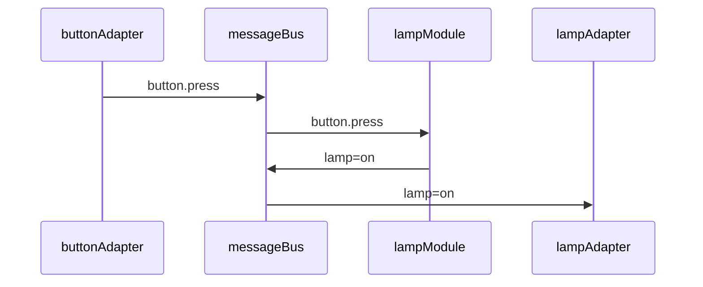
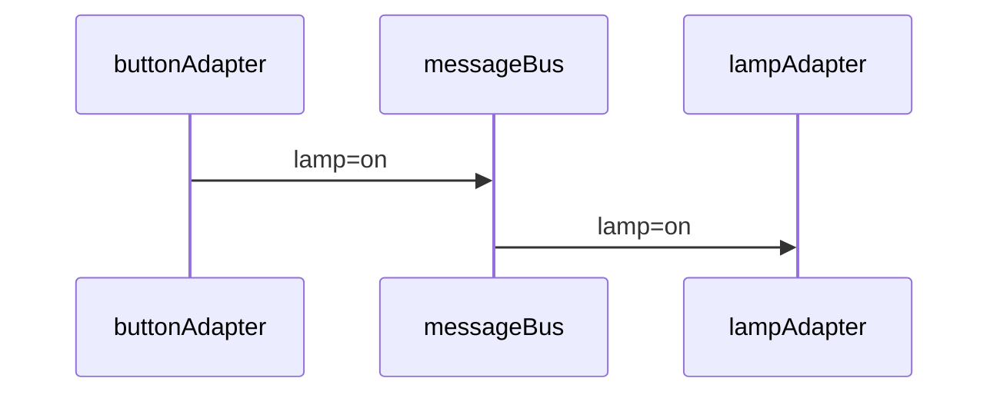

# SodaCan Module Language Guide

### Topics and Variables
In SodaCan, all topics, and therefore, all messages must be formally defined before they can be used. Furthermore, all variaable*carried by messages in a topic must be defined as well. 

A topic defines a schema (or format) of messages for a specific purpose. You can think of a topic as a channel for information flow of similarly formatted messages. Once defined, a topic usually lasts forever, or until manually deleted.

In a simple configuration topics can be created close to where they are commonly published. 

```
	MODULE lamp1Control
		PUBLISH livingRoom.lamp1 {off,on} AS lamp1
		
		...
			THEN lamp1=on
```

In the example above, the topic `livingRoom` and its one variable `lamp1` are created automatically with the declaration of the `PUBLISH` variable. The module is then free to publish to that topic immediately as shown in the example. In this case, `lamp1.on` causes the on value to be published.

But this approach is somewhat restrictive because one module seems to own the topic even though the topic in fact is defined globally. 

We can make this much tidier if we create a separate module that defines all or at least some of the topics and variables needed. Nothing else changes in either the producer or consumer. However, a neutral module can be thought of at the owner of the declaration thus allowing the other modules to come and go.


```
	MODULE livingRoomVariables
		PUBLISH livingRoom.lamp1 {off,on}
		// No other logic in this module
```

In the above, "livingRoom" is the topic and "lamp1" is a variable that will be exchanged via this topic. The `{off,on}` syntax means that the variable will hold an enumerated value of either "on" or "off". 

> Syntactic Sugar: SodaCan blurs the lines between string literals and identifiers. For example, no quotes are needed in the list of possible values of an enumerated variable. Likewise, the identifier expression `variable.value` is a shortcut. In `ON` and `WHEN` statements, it means the same as `variable == "value"` (true if variable equals the value). In a `THEN` statement, it means the same as `variable = "value"` (assign "value" to variable). 

Next, we define a module that produces a message in this topic. In this case, the message is conveying the state of lamp1 as "on" in a message to the named topic.


```
	MODULE button23
		PUBLISH livingRoom.lamp1 {on,off} AS lamp
		ON <some condition>
			THEN lamp=on
			
```

And, a consumer module interested in this kind of message:


```
	MODULE lamp1
		SUBSCRIBE livingRoom.lamp1 {on,off} as lamp
		ON lamp==on
			THEN <do something>

```
 
A `PUBLISH` declaration has behavior in addition to defining a topic and variable. When the module changes the value of a PUBLISH variable, that variable will be automatically published at the end of the cycle.

A `SUBSCRIBE` variable will automatically subscribe to messages with that topic and variable. When a message arrives, the value of that variable will be changed in the module. Then, any `ON` statements matching that variable will be executed.

Declaring both a publish and subscribe for the same variable will cause a compile error.


### Module behavior
A module waits quietly for either the passage of time or a message to arrive. If two or more messages arrive at the same time, one is chosen to go first. At that point, the list of `AT` (in the case of the passage of time) or `ON` (the arrival of a message) statements is considered, one at a time, in the order which they are declared, until one *matches*. The `THEN` statement(s) of the corresponding `ON` or `AT` is then executed. At that point, no further checks are made of the `AT`s and `ON`s. Each message or passage of time that is processed by a module is called a `cycle`.

Processing then continues to the `WHEN` statements. These `WHEN` statements are not tied to any message in particular but they do react to changes made from the `THEN`s executed above. `WHEN` statements are optional but can greatly improve the maintainability of a module. First, a bad example, without using a `WHEN`:


```
	MODULE lamp1
		SUBSCRIBE mode {off,auto,on}	
		SUBSCRIBE event	{toggle}
		PUBLISH state {on,off}
		AT midnight ON Fridays   // If it's midnight Friday
		  AND mode==auto   		// And auto mode is on
		  THEN state=on  			// set the lamp state to on
	->	  THEN log("Lamp is on")	// Say so
		AT sunset ON Thursdays   // If it's sunset on Thursdays
		  AND mode==auto   		// and in auto mode
		  THEN state=on  			// set lamp state to on
	->	  THEN log("Lamp is on")	// Say so
		  
```
The "lamp is on" message is duplicated in the example above. 

We can fix this problem by using a `WHEN`in the example below. It will send a message regardless of which condition caused the state variable to change.

```
	MODULE lamp1
		SUBSCRIBE mode {off,auto,on}	
		SUBSCRIBE event	{toggle}
		PUBLISH state {on,off}
		AT midnight ON Fridays   // If it's midnight Friday
		  AND mode==auto   		// And auto mode is on
		  THEN state=on  			// set the lamp state to on
		AT sunset ON Thursdays   // If it's sunset on Thursdays
		  AND mode==auto   		// and in auto mode
		  THEN state=on  			// set lamp state to on
	->	WHEN state==on				// If state is on
		  THEN log("Lamp is on")	// say so.
		  
```
A `WHEN` only executes when the stated variable changes during a cycle. In the example above, if the state variable was already `on` then the `WHEN` statement will have no effect.

The passage of time may not trigger any `ON` statements. That's normal. However, for messages, if no matching `ON` statement is found, then an error is thrown. Why? When a `module` subscribes to a particular topic, it declares its intent to deal with that message. If that doesn't happen, there's a problem: Either the `SUBSCRIBE` is wrong or the `ON`s are wrong or missing. 

### Module Instance
The examples so far are typically called lamp1, lamp2, etc. suggesting that a different module definition is needed for each device, even if the behavior of all of the devices so numbered are identical. An alternate is to define a module with instances. That is simple enough. Here is an example:

```
	MODULE lamp[location]
		SUBSCRIBE mode[location] {off,auto,on}	
		...
			
```
One module definition that handles all devices of a certain type.

In this example, we made the following changes:

1. Change the name of the module to `lamp` (this just looks cleaner, SodaCan doesn't care what you call a module as long as it is unique),
2. Add the square brackets on the module line. This indicates that the module supports multiple instances. 
3. The name of a variable in the square brackets will be used to differentiate between different instances. 
4. It also means that messages we want to subscribe to must specify the location.  For example, another module that represents an individual button will need to publish a message that contains the location in addition to naming the variable to publish.

Here is an over-simplified example of an individual button that is not an instance-based module. But you'll see that when it is ready to publish an event, the message will specify the location. In this case, "hallway".

```
	MODULE button3					// A specific button
		PUBLISH mode[location] {off,auto,on}
		...
		    THEN mode["hallway"]=auto
```

If a module can be useful for many different devices but the behavior of each device is the same, then rather than making copies of the module with a slight name change, the module can be written to have module instances.  
When a module has instances, a mechanism is needed to create and keep track of such instances. Here is an example of a module that has instances. In this case, location is what differentiates each instance. And you'll notice that the `SUBSCRIBE` statement shown is qualified by the name of the instance. In other words, that subscription will listen for messages by location (with a variable name of `event`.

```
	MODULE lamp[location]
		SUBSCRIBE event[location] {toggle}
		...
		ON event==toggle
		...
			
```
Instance creation is done by the command-line interface, the SodacanAPI or the browser-based control panel. You cannot create an instance from a module.
However, the creation process, as usual, is done via message and we can be notified after the new instance is created:
For that, you simply subscribe to the instance event. In this case, named "location". This event is sent to the module itself, not an instance.

```
	MODULE lamp[location]
		SUBSCRIBE state[location] {off,on}
		SUBSCRIBE location	// Respond to a new instance being created
		...
		ON event==toggle
		...
		ON location			// Respond to a new instance being created
		    THEN state=off
		    THEN print(location)
			
```

Now, a module can also keep and publish variables and messages module-wide. Think of the module as having a special instance that represents the whole module (A 'static' variable in some languages). But there's a problem: SodaCan never allows peeking into another module which means no peeking into another instance. To solve this problem, we simply send a hidden message from one instance to another including from the top-level instance to it's instances. This is all handled transaparently.

Why so strict even in this situation? Because all instances of one module, including the top-level module, don't necessarily run in the same agent and maybe not even the same server. 

This approach works great when the top-level module makes a change that needs to be propagated to the children. 
However, children to parent is not so obvious. Basically, this should be avoided unless the purpose is to collect statistics such as a count. From an instance, in the following. When the 'count` variable is modified, it is broadcast, as usual. 


```
	MODULE lamp[location]
		SUBSCRIBE state[location] {off,on}
		SUBSCRIBE new.location	  // Respond to a new instance being created
		PUBLISH count 0			  // published by the top-level module
		SUBSCRIBE count[location]  // received by each instance
		ON new.location
			THEN count++
		...
			
```
 
### Module Time
Detecting the passage of time is often important for automation problems. Within a module, the `AT` statement demonstrates the need for time based events, however, the infrastructure has the responsibility to interpret the requirements specified in a module and respond accordingly. And do it efficiently. One particularly complex aspect is being able to reproduce the passage of time in the future. In other words, we need to be able to look back in time and see that an `AT` event was actually triggered. 
Conceptually, it looks like this (but don't try this at home). The lines with * are imaginary.

```
	MODULE lamp
		*PUBLISH AtNoonOnFridays
		...
		AT noon ON Fridays // Raise an event at noon on Fridays
			*THEN activate(AtNoonOnFridays)
			THEN ... what happens at noon on Fridays
		*ON AtNoonOnFridays
			*THEN ... what happens at noon on Fridays
```
 

Here's how this works in Sodacan: Unlike `ON` statements, which respond to explicit messages, `AT`statements are simply watching a clock looking for a match. To make these time-based events auditable and reproducible, the `AT` statements do watch the clock, but when one matches, it doesn't take action directly. Rather, a special message is sent to the module (itself) which then reacts as if it were an `ON` statement (This special message is invisible to the module author).

1. "AT noon ON Fridays" matches the current time (it *is* noon and it *is* a Friday). 
2. The agent running the module constructs and sends a special message with the id of the matching `AT` statement. 
3. The special message is then processed as usual a moment later. Should the module currently be busy with a different message, then the special message will be processes after that one is done. At this point, `ON` message flow and `AT` message flow have been synchronized.
4. When the special message is processed but the module, the `THEN` statement of the corresponding `AT` is executed. If there is a `WHEN` statement as part of the `AT` statement, it is also evaluated and may result in the special message being ignored.
5. At this point, the module can go back to listening for new messages.

Then, when needed, there is a complete audit trail in the message stream including hard `ON` events and timed `AT` events in the order in which they were processed.

> Race Condition (not a bug): The special message originates from an instance of the module which may be different from the instance of the module when the special message is processed, due to an intervening update to the module. The time gap is very small and their are most likely no ill effects with one exception: If updating a module results in a deletion of the AT statement, then the special message has nothing to match and will simply be dropped. It would be nice to insure that the special message could synchronously get in front of the queue, but that's not how message serialization works.
 
### Module Instance Time

A slight complication in modules involves `AT` statements. If a module is declared as having an instance key and one ore more `AT` statements, such as:

```
	MODULE lamp[location]
		...
		AT noon ON fridays
			THEN ...
```

that means that there is actually one module per instance. And that means that if a time event is triggered, it will be sent to each "instance" of the module. And that may be exactly what is desired. For example, at the time of the time event, the special message is sent to all known instances **at that time**. Looking back in time, it will be obvious that a newly added instance would not have received the special message.

### Module Timers
A timer is used when an action is to be taken in the future. And in many cases, one should be able to cancel or reset the timer. Here's an example:

```
	MODULE lamp1
		...
		SUBSCRIBE state {off, on}
		SUBSCRIBE livingRoom.motion AS motion
		TIMER offTimer 30 minutes
		...
		ON offTimer					// If we get a message from the offTimer
			THEN state=off				// Turn the light off
		ON state==on					// When state becomes on	
			THEN offTimer=start 		// Set a timer to turn it off
		ON motion						// On motion, reset the timer
			THEN offTimer=reset
		WHEN state==off					// When lamp1 goes off, time is no longer needed
			THEN offTimer=cancel
```

This example is simplified but it does explain the basic timer mechanism.

What is actually happening? The `ON state.on` is saying: When the state variable transitions to  `on`, do the `THEN` statement that follows it.
The `THEN` statement says to publish the `offTimer` message, but not immediately. Rather, SodaCan should wait for 30 minutes before doing so. The SodaCan agent for this module sets up a timer that will send a message to the module (itself) which will behave like any other message. It is perfectly OK to send a message you yourself. The the offTimer message is received, we have an `ON state.on` that picks it up and its `THEN` says to set the `state` to `off`.

> You'll notice a subtlety in the module compiler: the keyword `ON` begins a statement but it is no longer a keyword *within* the statement so you are free to use a state name such as `on` without conflict.  

Because this timer publishes a real message, some other module could also subscribe to the message and take some unrelated action to the offTimer message goes off (separate from the state.off and .on messages). This message also joins the other messages in the topic which forms the historical audit log and maintains the sequential nature of message processing (no side effects).

> If for any reason the state is already "off" when the `OffTimer` message is processed, then the `state.off` action has no effect. If the state does transition to off, then any `WHEN`s in the module that react to that state change will trigger as usual.

### Module Processing Cycle
`ON` and `WHEN` statements may seem to work the same way. While it is true that the contents of the statement can look the same, the behavior is very different. During a processing cycle, the first 'AT' to match a change in the module state "wins" and all other `AT`s are ignored for that cycle. Conversely, *all* of the `WHEN`s that *match* during that same cycle are executed. 

> In a procedural language, the `ON`s are like a series of `IF THEN ELSE` statements and the `WHEN`s are like a series of `IF THEN` statements following the `IF THEN ELSE` statements.

### Module Instance Topic Persistence
How does the SodaCan agent responsible for that module determine all of the module instances to broadcast to when this happens? A separate, parallel to the module, topic is created for each module which contains instances. This topic can be replayed to get the list of topics. There is only one entry per instance of the module that have been created. The following contains the format of messages in this topic all relevant data, the instance name, is in the key:

 | Key Component        | Description |
 | ----------- | ----------- |
 | instance | The instance key (for example, location of a light switch) |
 
This approach is very efficient and does not cause any concurrency issues. 

### Message-Variable Duality
In SodaCan, a variable defined in a module can be the source or destination for messages. When a message arrives, it is immediately stored in the named variable thus making it available to the module. In the following example, lamp1 is interested in the state of switch 1.

```
MODULE lamp1
	SUBSCRIBE switch1.state {on,off}
	...
	ON switch1.state==on
		THEN ...
```
Behind the scenes, SodaCan consumes a message and makes a note that its value has changed. In that case, it signals an event which the `ON` statements in the module will react to. 

The publishing side is similar. A `PUBLISH` variable is a message-in-waiting. Once a processing cycle is completed, `PUBLISH` variables that have been modified will be published.

```
MODULE switch1
	PUBLISH state {on,off}
	...
	ON ...
		THEN state==on		// Set the state to on
```

In the background, the SodaCan agent monitors each `PUBLISH` variable and, if any changes are made to it by any of the module's `THEN` statements, a message will be published containing that variable. In this example, `state` is the variable so the message will be published as `switch1.state` with a value of `on`.

> Semantics: You cannot `SUBSCRIBE` and `PUBLISH` the same variable. 

The message causing the current value of a variable remains with the variable. This makes it easy to access meta-information such as when the message was sent:

```
MODULE lamp1
	SUBSCRIBE switch1.state {on,off}
	...
	ON switch1.state==on
		*THEN system.log#info = switch1.state#timestamp
```
*which says: "send the timestamp of the message that populated `switch1.state` to the system log".
### Module Instantiation
In simple configurations, there may only be a single instance of each type of module. One living room lamp, one living room light switch, etc. In this case, messages will have an empty `key` attribute.  Other modules can be configured to handle a class of devices. For example, an organization might have a single lighting configuration which is used in all (or most) locations. Each office, for example, could behave the same but independent of other offices. In this case, the `'key' attribute of a message will contain the office (or location) name. Not much changes when a module is representing a class of devices rather than a single device. The module name would normally change. Instead of

```
	MODULE JoesOfficeLight
```

a more appropriate module name in this case will be

```
	MODULE OficeLight[location]
```
which says there is a single office light *class* of module but that a separate *instances* of the module are created for each location.
Of course in this case we also need to make sure our variables are separated by location. 

```
	MODULE OficeLight[location]
		PUBLISH state[location] {on,off}
		
```
which tells SodaCan that the `state` variable is separate for each location.

While the state variable (and consequently messages) are per-location, we might need other variables that apply to the entire class. Consider a company that has a policy of putting all lights into auto mode at a certain time of day requiring motion detecting for the light to remain on. That time is set company-wide. In this case we would like to send a single message to the "OfficeLight" module with the time all offices should go into auto mode. 

```
	MODULE OficeLight[location]
		SUBSCRIBE autoModeOnTime 00:00
		PUBLISH state[location] {on,off}
		
```
Notice that the `autoModeOnTime` variable has no key associated with it. A subsequent `AT statement` will refer to `autoModeOnTime`, without a key qualifier.

```
	MODULE OficeLight[location]
		SUBSCRIBE autoModeOnTime 00:00
		PUBLISH mode[location] {auto,manual}
		PUBLISH state[location] {on,off}
		AT autoModeOnTime
			THEN mode[location]=auto
		...
		
```
### Adapters
A SodaCan adapter is an end node in a SodaCan implementation. There are two primary types of adapter: message consumer and message producer. However, adapters can also be both a consumer and producer at the same time. 
The following is a very simple interaction between a lamp and a button and a module that controls the behavior of the lamp (on or off). A real-world example would likely have additional capabilities but we keep it simple here:


Flow of control:
1. `buttonAdapter` running on a microcontroller such as a Raspberry PI, monitors a *digital in* pin and when it goes positive (ignoring debounce logic), a message is published to the SodaCan `messageBus`.
2. The message is delivered to the `lampModule` which has subscribed to this type of message.
3. The `lampModule` determines if the button press is and off or on transition (it keeps track of the state of the lamp).
When the state of the lamp in the `lampModule` changes, another message containing the new state is published to the `messageBus`.
4. The `lampAdapter`, running on a microcontroller subscribes to lamp's state message and upon receipt of this message sets a digital output pin high or low depending on the content of the message.

If there is no need for logic in the lampModule, then it can be eliminated and the message published by the button read directly by the adapter module, like this:



Technically, an adapter is really just another module that has a bit of low-level code attached to it. It is also may be tied to a specific host if necessary. The low-level code (C, Java, etc) handles the details of device access: DIGITAL IN, OUT, SPI, D-A, A-D, etc. It also can do database IO or whatever else one can imagine. In the example below, the adapter module waits for a message about the state of the `lamp`. As usual, the `ON` detects the message, updates the variable with the new value and `THEN` makes a function call:

```
	MODULE lamp3
		SUBSCRIBE livingRoom.lamp AS lamp
		EXTERNAL someFunction
		ON lamp
			THEN someFunction
```
The function in the custom code attached to the module can then access any variables in the module. When the `someFunction` function call returns, the cycle is complete. The module then waits for the next message.

### Message Persistence
When a message is produced, it takes on a life of its own; Neither belonging to the producer nor to any of its potential consumers. At that point, the message is owned and stored (persisted) by the message bus. 
There is no sure-fire way for SodaCan to know when a message has been completely consumed. For example, a module that *might* consume a particular type of message 
may not exist yet. If resources were infinite, there is no reason SodaCan would need to recover space used by any messages.
The messages within a topic can come and go. Indeed, most topics define the lifetime of messages contained within that topic.

Consider, for example, that we want to add a new module to an existing configuration that reports on the average number of uses of a certain button per month. In a traditional system, the data could be a challenge to create. Historical data may not even exist. But in SodaCan, the data already exists in the topic that was used to get the button press notification to the lamp that is controlled by that button press. (Just because the message was *consumed* by one module does not mean that the message will be discarded). So, the new reporting module simply subscribes to that same topic and it will get all of the messages from the past in chronological order.

Now, SodaCan has several ways to deal with old messages in a topic. One can set an expiration date for a particular topic: Messages older than a certain number of days, weeks, months, or years will be automatically deleted. Or, when a topic exceeds a certain size, older messages can be deleted. Finally, one can just let the messages accumulate forever. Consider that many messages in a SodaCan application are quite small. Our button activation message will be about 50 bytes long. If we press that button 50 times per day, every day for a year, that would add up to less than one megabyte of data. Therefore, it's probably not worth cleaning up this type of message if there is even a small change of using that data in the future. On the other hand, messages from a security camera are much larger and so the topic should probably be purged either based on size (a very safe option) or the age of messages.

### System Messages
The messaging system is also used for administrative and operational purposes. Any agent running a module or an adapter routes error messages to a log topic.
SodaCan uses an administrative topic to deploy modules to the appropriate agent/server. Therefore, in a clustered setup, it is not necessary to manually keep application files on individual servers. By default, Module persistence is also kept in an administrative topic. 

| Topic | Description |
| ----- | ------------|
| xxx  | All mode commands are broadcast on this topic, see CLI for details |
| module | 

### Special Variables
In addition to variables that you explicitly define in your module, some are special in that they provide access to the agent, system, or custom plugins. 
Variables can also have attributes. Most special variables provide access to plugins. Some attributes are actually attributes on all variables. For example, a SUBSCRIBE variable provides access to when the message was created, which module (or plugin) sent it, etc.

Special attribute names are preceded by a hash (#) symbol. for example, assuming the following is a SUBSCRIBE variable named "mode",  `mode.#msgid' will access the message id of the last message that set that variable. Those marked *read* are read-only. *read/write* attributes can be assigned to. Some are write only *write*.

Note: A module variable is a variable defined in a module: publish, subscribe, private, or topic.

| variable | Attribute| read/write |Description |
| ----- | ---- | --- | ------------|
| *any subscribe variable* | #timestamp|read | The timestamp (UTC Z-time) of the message |
| *any subscribe variable* | #msgid|read | The timestamp (UTC Z-time) of the message |
| *any subscribe variable* | #topic|read | The topic of the message |
| *any subscribe variable* | #namespace|read | The topic of the message |
| *any subscribe variable* | #version|read | The message format version |
| *any module variable* | #type|read | The type of variable (string, number, boolean, etc) |
| *any module variable* | #modified|read | True if modified in this cycle |
| *any module variable* | #initialValue|read | The initial value of the variable as declared |
| *any module variable* | #constraints|read | The constraints specified for this variable. |
| *any publish variable* | #modified|read | True if modified in this cycle and will be published at the conclusion of the cycle |
| system.config | #latitude | read | Latitude of this location |
| system.config | #longitude | read | Longitude of this location |
| system.config | #timezone | read | Timezone of this location |
| system.config | #locationName | read | Name of this location |
| system.config | #locationAddress | read | Address of this location |
| system.clock | #month |read | The month of the current datetime |
| system.clock | #day |read | The day of the current datetime |
| system.clock | #year |read | The year of the current datetime |
| system.clock | #hour |read | The hour of the current datetime |
| system.clock | #minute |read | The minute of the current datetime |
| system.clock | #second |read | The seconds of the current datetime |
| system.clock | #sunrise |read | Today's sunrise |
| system.clock | #sunset |read | Today's sunrise |
| system.clock | #season |read | The current season |
| system.clock | #season |read | Today's sunset |
| system.log | # info |write | Write informational text to system log |
| system.log | # warn |write | Write warning text to system log |
| system.log | # alert |write | Send general alert message and log it |
| system.module | #name | read | Name of this module |
| system.module | #eventType | read | message or clock event |
| system.module | #source | read | Current source code of module |
| system.agent | #name | read | Name of the agent hosting this module |
| rpi4.gpio2 | # mode | read/write | Set mode for GPIO 2|
| rpi4.gpio2 | # pin | read/write | Set/get pin for GPIO 2|
| dmx.fixture2 | #red | write | Set the red color value in (lighting) fixture2 |

